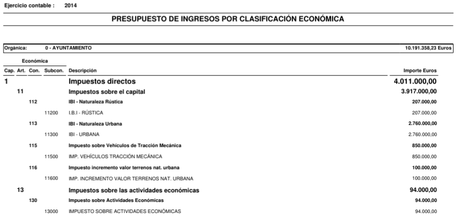
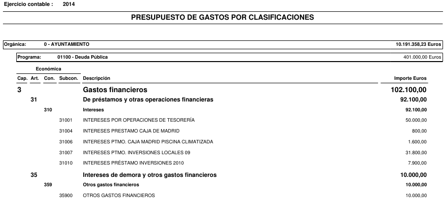

```{r setup, include=FALSE}
library(flexdashboard)
library(tidyverse)
library(tidylog, warn.conflicts = FALSE)
library(plotly)
library(sunburstR)
library(xlsx)
```

```{r cache=T}
# PREPROCESAMIENTO DE DATOS
# Carga clasificación gastos
programas <- read.xlsx("Gastos.xlsx", sheetName = "Programas")
programas$Código <- as.factor(programas$Código)
capitulos <- read.xlsx("Gastos.xlsx", sheetName = "Capítulos")
capitulos$Código <- as.factor(capitulos$Código)
articulos <- read.xlsx("Gastos.xlsx", sheetName = "Artículos")
articulos$Código <- as.factor(articulos$Código)
censo <- read.xlsx("Gastos.xlsx", sheetName = "Censo")
censo <- censo %>% mutate(Año = as.factor(Año))

# Carga de gastos formato Emiliano
# Limpieza previa:
# - Fundir programa 16101 con 16100 Abastecimiento agua
# - Fundir programa 16200 con 16210 Recogida de residuos (consermancha)
# - Fundir programa 17100 con 17000 Medio ambiente
gastos <- read_csv("gastos.csv") %>%
  mutate(
    Economica = as.character(Economica), 
    Programa = as.factor(Programa),
    cod.capitulo = as.factor(substr(Economica, 1, 1)),
    cod.articulo = as.factor(substr(Economica, 1, 2)),
    cod.concepto = as.factor(substr(Economica, 1, 3)),
    cod.subconcepto = as.factor(substr(Economica, 1, 5))) %>%
# Convertir columnas de años en filas
  pivot_longer(
    cols = starts_with('2'), 
    names_to = "Año", 
    names_ptypes = list(
      Año = factor(
      levels = c("2010", "2011", "2012", "2013", "2014", "2015", "2016", "2017", "2018", "2019", "2020", "2021", "2022"), 
      #ordered = TRUE
    )),
    values_to = "Cantidad") %>%
  # Eliminar los totales por capítulos
  filter(!is.na(Programa)) %>%
  # Reemplazar NAs por ceros
  replace_na(list(Cantidad=0))

# Filtrar totales por programas y renombrar variables
gastos.programas <- gastos %>% 
  filter(is.na(Economica)) %>%
  rename(cod.programa = Programa, Programa = Descripcion)

# Eliminar totales por programas
gastos <- gastos %>% filter(!is.na(Economica)) %>%
  # Fusionar tabla de gastos con tabla de capítulos y artículos
  left_join(capitulos, by=c("cod.capitulo"="Código")) %>%
  left_join(articulos, by=c("cod.articulo"="Código"))

# Carga clasificación ingresos
capitulos <- read.xlsx("Ingresos.xlsx", sheetName = "Capítulos", colClasses=rep("character",2))
articulos <- read.xlsx("Ingresos.xlsx", sheetName = "Artículos", colClasses=rep("character",2))
conceptos <- read.xlsx("Ingresos.xlsx", sheetName = "Conceptos", colClasses=rep("character",2))

# Carga de ingresos formato Emiliano
ingresos <- read_csv("ingresos.csv") %>%
  mutate(Economica = as.character(Economica),
         cod.capitulo = as.factor(substr(Economica, 1, 1)),
         cod.articulo = as.factor(substr(Economica, 1, 2)),
         cod.concepto = as.factor(substr(Economica, 1, 3)),
         cod.subconcepto = as.factor(substr(Economica, 1, 5))) %>%
  # Convertir columnas de años en filas
  pivot_longer(
    cols = starts_with('2'),
    names_to = "Año",
    names_ptypes = list(
      Año = factor(
        levels = c("2010", "2011", "2012", "2013", "2014", "2015", "2016", "2017", "2018", "2019", "2020", "2021", "2022"),
        #ordered = TRUE
        )),
    values_to = "Cantidad") %>%
  # Eliminar totales por capítulo
  filter(!is.na(Economica)) %>%
  # Reemplazar NAs por ceros
  replace_na(list(Cantidad=0)) %>%
  # Fusionar tabla de gastos con tabla de programas
  left_join(capitulos, by=c("cod.capitulo"="Código")) %>%
  left_join(articulos, by=c("cod.articulo"="Código")) %>%
  left_join(conceptos, by=c("cod.concepto"="Código"))

# Carga de cargos desde Excel 
cargos <- read.xlsx("2017/gastos-2017.xlsx", sheetName = "Cargos")
```

```{r funciones}
gasto.total <- function(gastos, año){
  total <- gastos %>% filter(Año==año) %>% summarise(Total = sum(Cantidad))
  return(paste(format(total$Total, big.mark="."), '€'))
}

gasto.habitante <- function(censo, gastos, año){
  total <- gastos %>% filter(Año==año) %>% summarise(Total = sum(Cantidad))
  poblacion <- censo %>% filter(Año==año)
  return(paste(format(round(total$Total / poblacion$Población, 2), decimal.mark = ","),  '€'))
}

plot.gastos.programas <- function(gastos, año){
  gastos.programas <- gastos %>% filter(Año==año) %>% group_by(Programa) %>% summarise(Cantidad=sum(Cantidad))
  xaxis <- list(showgrid=F, zeroline=F, showticklabels = F)
  yaxis <- list(showgrid=F, zeroline=F, showticklabels = F)
  p <- plot_ly(gastos.programas, labels = ~Programa, values = ~Cantidad, type = 'pie', textposition = 'none', hoverinfo="text+percent", 
               text = ~paste(Programa, '</br>Cantidad: ', format(Cantidad,decimal.mark=",", big.mark="."), "€"), sort=T, direction="clockwise") %>%
  layout(xaxis=xaxis, yaxis=yaxis)
  return(p)
}

plot.variacion.gastos.programas <- function(gastos, año, limite = 10000){
  gastos %>% 
  filter(Año %in% c(año, año-1)) %>%
  pivot_wider(names_from = Año, values_from = Cantidad) %>%
  rename(actual = length(names(.))-1, anterior = length(names(.))) %>%
  group_by(Programa) %>%
  summarise(actual = sum(actual), anterior = sum(anterior)) %>%
  mutate(Variación = actual-anterior) %>%
  mutate(Porcentaje = Variación / anterior * 100, positive = Variación >= 0) %>%
  # Programas con una mariación mayor 10000€
  filter(abs(Variación) >= limite) %>%
  plot_ly(y = ~Programa, x = ~Variación, color = ~positive, type = "bar", orientation = 'h', hoverinfo = 'text', 
             hovertext = ~paste('Programa: ', Programa, '<br>Variación: ', format(Variación, decimal.mark=",", big.mark="."), "€  (", format(round(Porcentaje,2), decimal.mark=",", nsmall = 2), "%)")) %>%
  layout(yaxis = list(categoryorder = "total descending"), showlegend = FALSE, xaxis = list(showgrid=T, zeroline=T, nticks=20, showline=F, title="Variación con respecto al año anterior", tickprefix = '€', tickformat=",.2r", hoverformat = '.2f'))
}

plot.gastos.capitulos <- function(gastos, año){
  gastos.capitulos <- gastos %>% filter(Año==año) %>% group_by(Capítulo) %>% summarise(Cantidad=sum(Cantidad))
  xaxis <- list(showgrid=F, zeroline=F, showticklabels = F)
  yaxis <- list(showgrid=F, zeroline=F, showticklabels = F)
  p <- plot_ly(gastos.capitulos, labels = ~Capítulo, values = ~Cantidad, type = 'pie', textposition = 'none', hoverinfo="text+percent", 
               text = ~paste(Capítulo, '</br>Cantidad: ', format(Cantidad,decimal.mark=",", big.mark="."), "€"), sort=T, direction="clockwise") %>%
  layout(xaxis=xaxis, yaxis=yaxis)
  return(p)
}

plot.ingresos.capitulos <- function(ingresos, año){
  ingresos.capitulos <- ingresos %>% filter(Año==año) %>% group_by(Capítulo) %>% summarise(Cantidad=sum(Cantidad))
  xaxis <- list(showgrid=F, zeroline=F, showticklabels = F)
  yaxis <- list(showgrid=F, zeroline=F, showticklabels = F)
  p <- plot_ly(ingresos.capitulos, labels = ~Capítulo, values = ~Cantidad, type = 'pie', textposition = 'none', hoverinfo="text+percent", 
               text = ~paste(Capítulo, '</br>Cantidad: ', format(Cantidad,decimal.mark=",", big.mark="."), "€"), sort=T, direction="clockwise") %>%
    layout(xaxis=xaxis, yaxis=yaxis)
  return(p)
}

plot.ingresos.articulos <- function(ingresos, año){
  ingresos.articulos <- ingresos %>% filter(Año==año) %>% group_by(Artículo) %>% summarise(Cantidad=sum(Cantidad))
  xaxis <- list(showgrid=F, zeroline=F, showticklabels = F)
  yaxis <- list(showgrid=F, zeroline=F, showticklabels = F)
  p <- plot_ly(ingresos.articulos, labels = ~Artículo, values = ~Cantidad, type = 'pie', textposition = 'none', hoverinfo="text+percent", 
               text = ~paste(Artículo, '</br>Cantidad: ', format(Cantidad,decimal.mark=",", big.mark="."), "€"), sort=T, direction="clockwise") %>%
    layout(xaxis=xaxis, yaxis=yaxis)
  return(p)
}

plot.ingresos.conceptos <- function(ingresos, año){
  ingresos.conceptos <- ingresos %>% filter(Año==año) %>% group_by(Concepto) %>% summarise(Cantidad=sum(Cantidad))
  xaxis <- list(showgrid=F, zeroline=F, showticklabels = F)
  yaxis <- list(showgrid=F, zeroline=F, showticklabels = F)
  p <- plot_ly(ingresos.conceptos, labels = ~Concepto, values = ~Cantidad, type = 'pie', textposition = 'none', hoverinfo="text+percent", 
               text = ~paste(Concepto, '</br>Cantidad: ', format(Cantidad,decimal.mark=",", big.mark="."), "€"), sort=T, direction="clockwise") %>%
    layout(xaxis=xaxis, yaxis=yaxis)
  return(p)
}

plot.variacion.ingresos.conceptos <- function(ingresos, año, limite = 10000){
  ingresos %>% 
  filter(Año %in% c(año, año-1)) %>%
  pivot_wider(names_from = Año, values_from = Cantidad) %>%
  rename(actual = length(names(.))-1, anterior = length(names(.))) %>%
  group_by(Concepto) %>%
  summarise(actual = sum(actual), anterior = sum(anterior)) %>%
  mutate(Variación = actual-anterior) %>%
  mutate(Porcentaje = Variación / anterior * 100, positive = Variación >= 0) %>%
  # Programas con una mariación mayor 10000€
  filter(abs(Variación) >= limite) %>%
  plot_ly(y = ~Concepto, x = ~Variación, color = ~positive, type = "bar", orientation = 'h', hoverinfo = 'text', 
             hovertext = ~paste('Concepto: ', Concepto, '<br>Variación: ', format(Variación, decimal.mark=",", big.mark="."), "€  (", format(round(Porcentaje,2), decimal.mark=",", nsmall = 2), "%)")) %>%
  layout(yaxis = list(categoryorder = "total descending"), showlegend = FALSE, xaxis = list(showgrid=T, zeroline=T, nticks=20, showline=F, title="Variación con respecto al año anterior", tickprefix = '€', tickformat=",.2r", hoverformat = '.2f'))
}
```


<!-- # Sidebar {.sidebar data-width=200} -->

<!-- ## Evolución  -->

<!-- - [Gastos](#evolucion-gastos) -->
<!-- - [Ingresos](#evolucion-ingresos) -->

<!-- ## Años -->

<!-- -  [2022](#presupuesto-2022) -->
<!-- -  [2021](#presupuesto-2021) -->
<!-- -  [2020](#presupuesto-2020) -->
<!-- -  [2019](#presupuesto-2019) -->
<!-- -  [2018](#presupuesto-2018) -->
<!-- -  [2017](#presupuesto-2017) -->
<!-- -  [2016](#presupuesto-2016) -->
<!-- -  [2015](#presupuesto-2015) -->
<!-- -  [2014](#presupuesto-2014) -->
<!-- -  [2013](#presupuesto-2013) -->
<!-- -  [2012](#presupuesto-2012) -->
<!-- -  [2011](#presupuesto-2011) -->
<!-- -  [2010](#presupuesto-2010) -->

# Explicación

#### ¿Qué es el presupuesto

El presupuesto de gastos de una Entidad local es la autorización que hace el Pleno para que el gobierno de la Entidad pueda gastar. Esta autorización se refiere a un periodo de tiempo de un año.

Establece:

- Cantidad máxima de gasto
- En qué gastar
- Forma de financiar el gasto (ingresos)

Cualquier cambio en la cantidad o la finalidad de los gastos presupuestados debe tramitarse mediante  una modificación de crédito.

<i class='fa fa-exclamation-triangle' style='color:red'></i>Las modificaciones de crédito son bastante habituales, por lo que es mejor analizar las liquidaciones del presupuesto al final del ejercicio. 

#### Fases presupuestarias

1. Elaboración del presupuesto. Secretaría de Hacienda.
2. Aprobación del presupuesto por el Pleno de la Entidad local.
3. Ejecución del presupuesto por los órganos de gobierno de la Entidad local.
4. Verificación por el Pleno de la Entidad local de cómo se ha ajustado la ejecución del presupuesto al mandato inicialmente aprobado. Control financiero.

El Estado de liquidación del presupuesto recoge información sobre el presupuesto que aprobó el Pleno de la Entidad local y cómo se ha ejecutado. Por tanto, es el documento más adecuado para conocer la gestión de los ingresos y gastos que se ha realizado durante el año.

#### Estructura de los presupuestos

Se define en la [Orden EHA/3565/2008](http://www.boe.es/buscar/doc.php?id=BOE-A-2008-19916), de 3 de diciembre.

Estable una separación entre:

- **Ingresos**: Recoge la previsión de los recursos que la entidad espera obtener en el año para financiar los gastos que figuran en el presupuesto de gastos.
- **Gastos**: Recoge los gastos que se pretenden acometer durante el ejercicio. 

Los gastos no pueden ser nunca superiores a los ingresos.

#### Clasificación de los ingresos

El estado de ingresos se realiza de acuerdo a dos clasificaciones diferentes:

- **Económica**: Presenta la información atendiendo a la naturaleza económica de los derechos presupuestarios. Está definida por el Ministerio de Economía y Hacienda.
- **Orgánica**: Informa sobre quién ingresa. Las Entidades locales podrán clasificar los ingresos atendiendo a su propia estructura. 

##### Clasificación económica de los ingresos

Se distingue entre:

- Operaciones no financieras:
  - Operaciones corrientes: Ingresos habituales (impuestos y tasas).
  - Operaciones de capital: Ingresos de la venta de capital o provenientes de fondos para la construcción de infraestructuras o compra de bienes inventariables.
- Operaciones financieras: Ingresos en la recuperación de depósitos inmovilizados o de créditos. 

Utiliza las siguientes divisiones:

> Capítulo > Artículo > Concepto > Subconcepto

**Capítulo 1. Impuestos directos**:

- 1.1 IRPF (cesión porcentual del Estado).
- 1.2 IBI.
- 1.3 Impuesto sobre vehículos de tracción mecánica.
- 1.4 Impuesto sobre el incremento de valor de los terrenos (plusvalía).
- 1.5 Impuesto de actividades económicas.

**Capítulo 2. Impuestos indirectos**:

-  2.1 IVA (cesión porcentual del Estado).
-  2.2 Impuestos especiales sobre alcohol, tabaco e hidrocarburos (cesión porcentual del Estado).
-  2.3 Impuesto sobre construcciones, instalaciones y obras.

**Capítulo 3. Tasas y otros ingresos**: Tasas, precios públicos y contribuciones especiales que pagan los usuarios por la realización de una contraprestación municipal.  
**Capítulo 4. Transferencias corrientes**: Ingresos de naturaleza no tributaria destinados a gastos corrientes (transferencias del Estado y de la Comunidad Autónoma).  
**Capítulo 5. Ingresos patrimoniales**: Rentas de patrimonio del Municipio.  
**Capítulo 6. Enajenación de inversiones reales**: Venta de solares y fincas rústicas.  
**Capítulo 7. Transferencias de capital**: Ingresos de naturaleza no tributaria destinados a financiar gastos de capital (fondos de la UE).  
**Capítulo 8. Activos financieros**: Devolución de fianzas o depósitos inmovilizados.  
**Capítulo 9. Pasivos financieros**: Créditos solicitados a entidades privadas.

**Ejemplo**  


#### Clasificación de los gastos

El estado de gastos ordena los créditos de acuerdo con tres clasificaciones diferentes:

- **Por programas**: Informa sobre en qué se gasta, es decir, la finalidad del gasto.
- **Económica**: Informa sobre cómo se gasta, sobre la naturaleza económica del gasto.
- **Orgánica***: Informa sobre quién realiza el gasto.

##### Clasifiación por programas de gasto

Utiliza las siguientes divisiones:

> Área > Política > Grupo > Programa

**Área 0. Deuda pública**: Intereses y amortización de la Deuda Pública y demás operaciones financieras de naturaleza análoga, con exclusión de los gastos que ocasione la formalización de las mismas.  
**Área 1. Servicios públicos básicos**: Servicios públicos básicos que, con carácter obligatorio, deben prestar los Municipios. Incluyen cuatro políticas de gasto básicas: seguridad y movilidad ciudadana, vivienda y urbanismo, bienestar comunitario y medio ambiente.   
**Área 2. Actuaciones de protección y promoción social**: Actuaciones de protección y promoción social (pensiones de funcionarios, atenciones de carácter benéfico-asistencial, atenciones a grupos con necesidades especiales, como jóvenes, mayores, minusválidos físicos y tercera edad y medidas de fomento del empleo).  
**Área 3. Producción de bienes públicos de carácter preferente**: Sanidad, educación, cultura, ocio, deporte, y, en general, todos aquellos tendentes a la elevación o mejora de la calidad de vida.  
**Área 4. Actuaciones de carácter económico**: Actividades, servicios y transferencias para desarrollar el potencial de los distintos sectores de la actividad económica (infraestructuras básicas y de transportes, infraestructuras agrarias, comunicaciones, investigación, desarrollo e innovación).  
**Área  9. Actuaciones de carácter general**: Actividades que afecten, con carácter general, a la Entidad local, y que consistan en el ejercicio de funciones de gobierno o de apoyo administrativo y de soporte lógico y técnico a toda la organización. También los  gastos que no puedan ser imputados a otras áreas.

##### Clasifiación económica de los gastos

Se distingue entre:

- Operaciones no financieras:
  - Operaciones corrientes: Gastos habituales necesarios para el funcionamiento de los servicios públicos (gastos en personal, bienes y servicios).
  - Operaciones de capital: Gastos extraordinarios en inversiones reales o su financiación (creación de infraestructuras y adquisición de bienes de carácter inventariable).
- Operaciones financieras: Gastos en la adquisición de activos financieros o para la amortización de los préstamos.

Utiliza las siguientes divisiones:

> Capítulo > Artículo > Concepto > Subconcepto

**Capítulo 1. Gastos de personal**: Retribuciones, indemnizaciones, cotizaciones y planes de pensiones para todo el personal contratado.  
**Capítulo 2. Gastos corrientes y servicios**: Suministros, materiales y gastos de servicios o trabajos realizados por empresas ajenas contratadas.  
**Capítulo 3. Intereses**: Pago  de intereses derivados de operaciones financieras.  
**Capítulo 4. Transferencias corrientes**: Aportaciones a otras entidades o administraciones (estatales, autonómicas o empresas privadas) para financiar operaciones corrientes.  
**Capítulo 6. Inversiones reales**: Creación de nuevos equipamientos o infraestructuras y adquisición de bienes inventariables.  
**Capítulo 7. Transferencias de capital**: Pago de créditos para financiar operaciones de capital, que hayan financiado inversiones reales.  
**Capítulo 8. Activos financieros**: Adquisición de activos financieros para la constitución de depósitos y fianzas exigidos.  
**Capítulo 9. Pasivos financieros**: Pago de amortización de pasivos financieros (deuda).

**Ejemplo**  



# Evolucion gastos {data-navmenu="Evolución"}

## Column {.tabset}

### Gastos

```{r evolucion-gastos}
gastos.años <- gastos %>% group_by(Año) %>% summarise(Cantidad=sum(Cantidad))
gastos.años <- left_join(gastos.años, censo, by=c("Año"="Año"))
xaxis <- list(showgrid=F, zeroline=T, showline=F, title="Años")
yaxis <- list(showgrid=T, zeroline=T, nticks=20, showline=F, title="Cantidad", tickprefix = '€', tickformat=",.2r")
p <- plot_ly(gastos.años, x = ~Año, y=~Cantidad, type = "bar", hoverinfo = 'text', 
             text = ~paste('Año: ', Año, '<br>Cantidad: ', format(Cantidad,decimal.mark=",", big.mark="."), "€<br>Coste por persona: ", 
                           format(Cantidad/Población, decimal.mark=",", big.mark="."), "€")) %>% 
  layout(xaxis=xaxis, yaxis=yaxis)
p
```

### Evolución de los Gastos de los mayores programas

```{r}
# 10 mayores partidas
gastos.programas.mayores <- gastos.programas %>% group_by(Programa) %>% summarize(Cantidad=sum(Cantidad)) %>% top_n(15) %>% arrange(desc(Cantidad))
programas.mayores <- unique(gastos.programas.mayores$Programa)
```

```{r evolucion-gastos-programas}
gastos.años.programas <- gastos.programas %>% group_by(Año, Programa) %>% summarise(Cantidad=sum(Cantidad))
xaxis <- list(showgrid=F, zeroline=T, title="Años")
yaxis <- list(showgrid=T, zeroline=T, nticks=20, rangemode = "tozero", title="Cantidad", tickprefix = '€', tickformat=",.2r")
p <- gastos.programas %>% 
  filter(Programa %in% programas.mayores) %>%
  group_by(Programa, Año) %>% 
  summarise(Cantidad=sum(Cantidad)) %>%
  # group_by(Programa) %>%
  plot_ly(x=~Año, y=~Cantidad, color=~Programa) %>% 
  add_lines(hoverinfo = 'text', text = ~paste('Programa: ', Programa, '<br>Año: ', Año, '<br>Cantidad: ', format(Cantidad, decimal.mark=",", big.mark="."), "€")) %>% 
  layout(xaxis=xaxis, yaxis=yaxis)
p
```

### Evolución de los Gastos por capítulos

```{r evolucion-gastos-capitulos}
xaxis <- list(showgrid=F, zeroline=T, showline=F, title="Años")
yaxis <- list(showgrid=T, zeroline=T, nticks=20, showline=F, rangemode = "tozero", title="Cantidad", tickprefix = '€', tickformat=",.2r")
p <- gastos %>% 
  group_by(Capítulo, Año) %>% 
  summarise(Cantidad=sum(Cantidad)) %>%
  plot_ly(x=~Año, y=~Cantidad, color=~Capítulo) %>%
  add_lines(hoverinfo = 'text', text = ~paste('Capítulo: ', Capítulo, '<br>Año: ', Año, '<br>Cantidad: ', format(Cantidad, decimal.mark=",", big.mark="."), "€")) %>%
  layout(xaxis=xaxis, yaxis=yaxis)
p
```

### Evolución de los Gastos por artículos

```{r evolucion-gastos-articulos}
xaxis <- list(showgrid=F, zeroline=T, showline=F, title="Años")
yaxis <- list(showgrid=T, zeroline=T, nticks=20, showline=F, rangemode = "tozero", title="Cantidad", tickprefix = '€', tickformat=",.2r")
p <- gastos %>% 
  group_by(Artículo, Año) %>% 
  summarise(Cantidad=sum(Cantidad)) %>%
  plot_ly(x=~Año, y=~Cantidad, color=~Artículo) %>%
  add_lines(hoverinfo = 'text', text = ~paste('Artículo: ', Artículo, '<br>Año: ', Año, '<br>Cantidad: ', format(Cantidad, decimal.mark=",", big.mark="."), "€")) %>%
  layout(xaxis=xaxis, yaxis=yaxis)
p
```

# Evolucion ingresos {data-navmenu="Evolución"}

## Column {.tabset}

### Evolución de los Ingresos

```{r evolucion-ingresos}
xaxis <- list(showgrid=F, zeroline=T, showline=F, title="Años")
yaxis <- list(showgrid=T, zeroline=T, nticks=20, showline=F, title="Cantidad", tickprefix = '€', tickformat=",.2r")
p <- ingresos %>% 
  group_by(Año) %>% 
  summarise(Cantidad=sum(Cantidad)) %>% 
  plot_ly(x = ~Año, y=~Cantidad, type = "bar", hoverinfo = 'text', text = ~paste('Año:', Año, '<br>Cantidad:', format(Cantidad, decimal.mark=",", big.mark="."), "€")) %>%
  layout(xaxis=xaxis, yaxis=yaxis)
p
```

### Evolución de los Ingresos por capítulos

```{r evolucion-ingresos-capitulos}
xaxis <- list(showgrid=F, zeroline=T, showline=F, title="Años")
yaxis <- list(showgrid=T, zeroline=T, nticks=20, showline=F, rangemode = "tozero", title="Cantidad", tickprefix = '€', tickformat=",.2r")
p <- ingresos %>% 
  group_by(Capítulo, Año) %>% 
  summarise(Cantidad=sum(Cantidad)) %>%
  plot_ly(x=~Año, y=~Cantidad, color=~Capítulo) %>%
  add_lines(hoverinfo = 'text', text = ~paste('Capítulo: ', Capítulo, '<br>Año: ', Año, '<br>Cantidad: ', format(Cantidad, decimal.mark=",", big.mark="."), "€")) %>%
  layout(xaxis=xaxis, yaxis=yaxis)
p
```

### Evolución de los Ingresos por Artículos

```{r evolucion-ingresos-articulos}
ingresos.años.articulos <- ingresos %>% group_by(Año, Artículo) %>% summarise(Cantidad=sum(Cantidad))
xaxis <- list(showgrid=F, zeroline=T, showline=F, title="Años")
yaxis <- list(showgrid=T, zeroline=T, nticks=20, showline=F, rangemode = "tozero", title="Cantidad", tickprefix = '€', tickformat=",.2r")
p <- ingresos %>% 
  group_by(Artículo, Año) %>% 
  summarise(Cantidad=sum(Cantidad)) %>%
  plot_ly(x=~Año, y=~Cantidad, color=~Artículo) %>%
  add_lines(hoverinfo = 'text', text = ~paste('Artículo: ', Artículo, '<br>Año: ', Año, '<br>Cantidad: ', format(Cantidad, decimal.mark=",", big.mark="."), "€")) %>%
  layout(xaxis=xaxis, yaxis=yaxis)
p
```

### Evolución de los Ingresos por Concepto

```{r evolucion-ingresos-conceptos}
ingresos.años.concepto <- ingresos %>% group_by(Año, Concepto) %>% summarise(Cantidad=sum(Cantidad))
xaxis <- list(showgrid=F, zeroline=T, showline=F, title="Años")
yaxis <- list(showgrid=T, zeroline=T, nticks=20, showline=F, rangemode = "tozero", title="Cantidad", tickprefix = '€', tickformat=",.2r")
p <- ingresos %>% 
  group_by(Concepto, Año) %>% 
  summarise(Cantidad=sum(Cantidad)) %>%
  plot_ly(x=~Año, y=~Cantidad, color=~Concepto) %>%
  add_lines(hoverinfo = 'text', text = ~paste('Concepto: ', Concepto, '<br>Año: ', Año, '<br>Cantidad: ', format(Cantidad, decimal.mark=",", big.mark="."), "€")) %>%
  layout(xaxis=xaxis, yaxis=yaxis)
p
```


# Presupuesto 2022 {data-navmenu="Años"}

```{r 2022}
año <- 2022
```

## Column

### Total de Gasto

```{r}
valueBox(gasto.total(gastos, año), icon = "fa-euro")
```

### Gasto por habitante

```{r}
valueBox(gasto.habitante(censo, gastos, año), icon = "fa-user")
```


## Column {.tabset}

### Gastos

[Presupuesto de Gastos de 2022 íntegro](2022/presupuesto-gastos-2022.pdf)

```{r gastos-económica-2022}
gastos %>%
  filter(Año==año) %>% 
  group_by(Capítulo, Artículo) %>% 
  summarise(Cantidad=sum(Cantidad)) %>%
  unite(Categoría, Capítulo, Artículo, sep='-') %>%
  select(Categoría, Cantidad) %>%
  sunburst(legend=F, explanation = "function(d){return d.value.toLocaleString() + '€'}")
```

### Gastos por programas

Hacer clic en cada programa de la leyenda para activarlo o desactivarlo.
Desplazar la leyenda para ver el resto de programas.

```{r gastos-programas-2022}
plot.gastos.programas(gastos.programas, año)
```

### Gastos por Capítulos
```{r gastos-capitulos-2022}
plot.gastos.capitulos(gastos, año)
```

### Variación gastos programas

```{r variacion-gastos-programas-2022}
plot.variacion.gastos.programas(gastos.programas, año)
```

### Ingresos

[Presupuesto de Ingresos de 2022 íntegro](2022/presupuesto-ingresos-2022.pdf)

```{r ingresos-2022}
ingresos %>%
  filter(Año==año) %>%
  unite(Categoría, Capítulo, Artículo, Concepto, sep='-') %>%
  select(Categoría, Cantidad) %>%
  sunburst(legend=F, explanation = "function(d){return d.value.toLocaleString() + '€'}")
```

### Ingresos por Capítulos

```{r ingresos-capitulos-2022}
plot.ingresos.capitulos(ingresos, año)
```

### Ingresos por Artículos

```{r ingresos-articulos-2022}
plot.ingresos.articulos(ingresos, año)
```

### Ingresos por Conceptos

```{r ingresos-conceptos-2022}
plot.ingresos.conceptos(ingresos, año)
```

### Variación ingresos conceptos

```{r variacion-ingresos-conceptos-2022}
plot.variacion.ingresos.conceptos(ingresos, año)
```


<!-- ### Inversiones  -->

<!-- ```{r inversiones-2022} -->
<!-- inversiones <- read_csv("2022/inversiones.csv") -->
<!-- inversiones %>% -->
<!--   select(DESCRIPCIÓN, Cantidad) %>% -->
<!--   sunburst(legend = list(w=400), explanation = "function(d){return d.data.name + '<br>' + d.value.toLocaleString() + '€'}") -->
<!-- ``` -->


# Presupuesto 2021 {data-navmenu="Años"}

```{r 2021}
año <- 2021
```

## Column

### Total de Gasto

```{r}
valueBox(gasto.total(gastos, año), icon = "fa-euro")
```

### Gasto por habitante

```{r}
valueBox(gasto.habitante(censo, gastos, año), icon = "fa-user")
```


## Column {.tabset}

### Gastos

[Presupuesto de Gastos de 2021 íntegro](2021/presupuesto-gastos-2021.pdf)

```{r gastos-económica-2021}
gastos %>%
  filter(Año==año) %>% 
  group_by(Capítulo, Artículo) %>% 
  summarise(Cantidad=sum(Cantidad)) %>%
  unite(Categoría, Capítulo, Artículo, sep='-') %>%
  select(Categoría, Cantidad) %>%
  sunburst(legend=F, explanation = "function(d){return d.value.toLocaleString() + '€'}")
```

### Gastos por programas

Hacer clic en cada programa de la leyenda para activarlo o desactivarlo.
Desplazar la leyenda para ver el resto de programas.

```{r gastos-programas-2021}
plot.gastos.programas(gastos.programas, año)
```

### Gastos por Capítulos
```{r gastos-capitulos-2021}
plot.gastos.capitulos(gastos, año)
```

### Ingresos

[Presupuesto de Ingresos de 2021 íntegro](2021/presupuesto-ingresos-2021.pdf)

```{r ingresos-2021}
ingresos %>%
  filter(Año==año) %>%
  unite(Categoría, Capítulo, Artículo, Concepto, sep='-') %>%
  select(Categoría, Cantidad) %>%
  sunburst(legend=F, explanation = "function(d){return d.value.toLocaleString() + '€'}")
```

### Ingresos por Capítulos

```{r ingresos-capitulos-2021}
plot.ingresos.capitulos(ingresos, año)
```

### Ingresos por Artículos

```{r ingresos-articulos-2021}
plot.ingresos.articulos(ingresos, año)
```

### Ingresos por Conceptos

```{r ingresos-conceptos-2021}
plot.ingresos.conceptos(ingresos, año)
```

### Inversiones 

```{r inversiones-2021}
inversiones <- read_csv("2021/inversiones.csv")
inversiones %>%
  select(DESCRIPCIÓN, Cantidad) %>%
  sunburst(legend = list(w=400), explanation = "function(d){return d.data.name + '<br>' + d.value.toLocaleString() + '€'}")
```


# Presupuesto 2020 {data-navmenu="Años"}


```{r 2020}
año <- 2020
```

## Column

### Total de Gasto

```{r}
valueBox(gasto.total(gastos, año), icon = "fa-euro")
```

### Gasto por habitante

```{r}
valueBox(gasto.habitante(censo, gastos, año), icon = "fa-user")
```

## Column {.tabset}

### Gastos por programas

Hacer clic en cada programa de la leyenda para activarlo o desactivarlo.
Desplazar la leyenda para ver el resto de programas.

```{r gastos-programas-2020}
plot.gastos.programas(gastos.programas, año)
```

### Gastos por Capítulos
```{r gastos-capitulos-2020}
plot.gastos.capitulos(gastos, año)
```

### Ingresos por Capítulos

```{r ingresos-capitulos-2020}
plot.ingresos.capitulos(ingresos, año)
```

### Ingresos por Artículos

```{r ingresos-articulos-2020}
plot.ingresos.articulos(ingresos, año)
```

### Ingresos por Conceptos

```{r ingresos-conceptos-2020}
plot.ingresos.conceptos(ingresos, año)
```


# Presupuesto 2019 {data-navmenu="Años"}

```{r 2019}
año <- 2019
```

## Column

### Total de Gasto

```{r}
valueBox(gasto.total(gastos, año), icon = "fa-euro")
```

### Gasto por habitante

```{r}
valueBox(gasto.habitante(censo, gastos, año), icon = "fa-user")
```

## Column {.tabset}

### Gastos por programas

Hacer clic en cada programa de la leyenda para activarlo o desactivarlo.
Desplazar la leyenda para ver el resto de programas.

```{r gastos-programas-2019}
plot.gastos.programas(gastos.programas, año)
```

### Gastos por Capítulos
```{r gastos-capitulos-2019}
plot.gastos.capitulos(gastos, año)
```

### Ingresos por Capítulos

```{r ingresos-capitulos-2019}
plot.ingresos.capitulos(ingresos, año)
```

### Ingresos por Artículos

```{r ingresos-articulos-2019}
plot.ingresos.articulos(ingresos, año)
```

### Ingresos por Conceptos

```{r ingresos-conceptos-2019}
plot.ingresos.conceptos(ingresos, año)
```


# Presupuesto 2018 {data-navmenu="Años"}

```{r 2018}
año <- 2018
```

## Column

### Total de Gasto

```{r}
valueBox(gasto.total(gastos, año), icon = "fa-euro")
```

### Gasto por habitante

```{r}
valueBox(gasto.habitante(censo, gastos, año), icon = "fa-user")
```

## Column {.tabset}

### Gastos por programas

Hacer clic en cada programa de la leyenda para activarlo o desactivarlo.
Desplazar la leyenda para ver el resto de programas.

```{r gastos-programas-2018}
plot.gastos.programas(gastos.programas, año)
```

### Gastos por Capítulos
```{r gastos-capitulos-2018}
plot.gastos.capitulos(gastos, año)
```

### Ingresos por Capítulos

```{r ingresos-capitulos-2018}
plot.ingresos.capitulos(ingresos, año)
```

### Ingresos por Artículos

```{r ingresos-articulos-2018}
plot.ingresos.articulos(ingresos, año)
```

### Ingresos por Conceptos

```{r ingresos-conceptos-2018}
plot.ingresos.conceptos(ingresos, año)
```


# Presupuesto 2017 {data-navmenu="Años"}

```{r 2017}
año <- 2017
```

## Column

### Total de Gasto

```{r}
valueBox(gasto.total(gastos, año), icon = "fa-euro")
```

### Gasto por habitante

```{r}
valueBox(gasto.habitante(censo, gastos, año), icon = "fa-user")
```

## Column {.tabset}

### Gastos por programas

Hacer clic en cada programa de la leyenda para activarlo o desactivarlo.
Desplazar la leyenda para ver el resto de programas.

```{r gastos-programas-2017}
plot.gastos.programas(gastos.programas, año)
```

### Gastos por Capítulos
```{r gastos-capitulos-2017}
plot.gastos.capitulos(gastos, año)
```

### Ingresos por Capítulos

```{r ingresos-capitulos-2017}
plot.ingresos.capitulos(ingresos, año)
```

### Ingresos por Artículos

```{r ingresos-articulos-2017}
plot.ingresos.articulos(ingresos, año)
```

### Ingresos por Conceptos

```{r ingresos-conceptos-2017}
plot.ingresos.conceptos(ingresos, año)
```


# Presupuesto 2016 {data-navmenu="Años"}

```{r 2016}
año <- 2016
```

## Column

### Total de Gasto

```{r}
valueBox(gasto.total(gastos, año), icon = "fa-euro")
```

### Gasto por habitante

```{r}
valueBox(gasto.habitante(censo, gastos, año), icon = "fa-user")
```

## Column {.tabset}

### Gastos por programas

Hacer clic en cada programa de la leyenda para activarlo o desactivarlo.
Desplazar la leyenda para ver el resto de programas.

```{r gastos-programas-2016}
plot.gastos.programas(gastos.programas, año)
```

### Gastos por Capítulos
```{r gastos-capitulos-2016}
plot.gastos.capitulos(gastos, año)
```

### Ingresos por Capítulos

```{r ingresos-capitulos-2016}
plot.ingresos.capitulos(ingresos, año)
```

### Ingresos por Artículos

```{r ingresos-articulos-2016}
plot.ingresos.articulos(ingresos, año)
```

### Ingresos por Conceptos

```{r ingresos-conceptos-2016}
plot.ingresos.conceptos(ingresos, año)
```


# Presupuesto 2015 {data-navmenu="Años"}

```{r 2015}
año <- 2015
```

## Column

### Total de Gasto

```{r}
valueBox(gasto.total(gastos, año), icon = "fa-euro")
```

### Gasto por habitante

```{r}
valueBox(gasto.habitante(censo, gastos, año), icon = "fa-user")
```

## Column {.tabset}

### Gastos por programas

Hacer clic en cada programa de la leyenda para activarlo o desactivarlo.
Desplazar la leyenda para ver el resto de programas.

```{r gastos-programas-2015}
plot.gastos.programas(gastos.programas, año)
```

### Gastos por Capítulos
```{r gastos-capitulos-2015}
plot.gastos.capitulos(gastos, año)
```

### Ingresos por Capítulos

```{r ingresos-capitulos-2015}
plot.ingresos.capitulos(ingresos, año)
```

### Ingresos por Artículos

```{r ingresos-articulos-2015}
plot.ingresos.articulos(ingresos, año)
```

### Ingresos por Conceptos

```{r ingresos-conceptos-2015}
plot.ingresos.conceptos(ingresos, año)
```


# Presupuesto 2014 {data-navmenu="Años"}

```{r 2014}
año <- 2014
```

## Column

### Total de Gasto

```{r}
valueBox(gasto.total(gastos, año), icon = "fa-euro")
```

### Gasto por habitante

```{r}
valueBox(gasto.habitante(censo, gastos, año), icon = "fa-user")
```

## Column {.tabset}

### Gastos por programas

Hacer clic en cada programa de la leyenda para activarlo o desactivarlo.
Desplazar la leyenda para ver el resto de programas.

```{r gastos-programas-2014}
plot.gastos.programas(gastos.programas, año)
```

### Gastos por Capítulos
```{r gastos-capitulos-2014}
plot.gastos.capitulos(gastos, año)
```

### Ingresos por Capítulos

```{r ingresos-capitulos-2014}
plot.ingresos.capitulos(ingresos, año)
```

### Ingresos por Artículos

```{r ingresos-articulos-2014}
plot.ingresos.articulos(ingresos, año)
```

### Ingresos por Conceptos

```{r ingresos-conceptos-2014}
plot.ingresos.conceptos(ingresos, año)
```


# Presupuesto 2013 {data-navmenu="Años"}

```{r 2013}
año <- 2013
```

## Column

### Total de Gasto

```{r}
valueBox(gasto.total(gastos, año), icon = "fa-euro")
```

### Gasto por habitante

```{r}
valueBox(gasto.habitante(censo, gastos, año), icon = "fa-user")
```

## Column {.tabset}

### Gastos por programas

Hacer clic en cada programa de la leyenda para activarlo o desactivarlo.
Desplazar la leyenda para ver el resto de programas.

```{r gastos-programas-2013}
plot.gastos.programas(gastos.programas, año)
```

### Gastos por Capítulos
```{r gastos-capitulos-2013}
plot.gastos.capitulos(gastos, año)
```

### Ingresos por Capítulos

```{r ingresos-capitulos-2013}
plot.ingresos.capitulos(ingresos, año)
```

### Ingresos por Artículos

```{r ingresos-articulos-2013}
plot.ingresos.articulos(ingresos, año)
```

### Ingresos por Conceptos

```{r ingresos-conceptos-2013}
plot.ingresos.conceptos(ingresos, año)
```


# Presupuesto 2012 {data-navmenu="Años"}

```{r 2012}
año <- 2012
```

## Column

### Total de Gasto

```{r}
valueBox(gasto.total(gastos, año), icon = "fa-euro")
```

### Gasto por habitante

```{r}
valueBox(gasto.habitante(censo, gastos, año), icon = "fa-user")
```

## Column {.tabset}

### Gastos por programas

Hacer clic en cada programa de la leyenda para activarlo o desactivarlo.
Desplazar la leyenda para ver el resto de programas.

```{r gastos-programas-2012}
plot.gastos.programas(gastos.programas, año)
```

### Gastos por Capítulos
```{r gastos-capitulos-2012}
plot.gastos.capitulos(gastos, año)
```

### Ingresos por Capítulos

```{r ingresos-capitulos-2012}
plot.ingresos.capitulos(ingresos, año)
```

### Ingresos por Artículos

```{r ingresos-articulos-2012}
plot.ingresos.articulos(ingresos, año)
```

### Ingresos por Conceptos

```{r ingresos-conceptos-2012}
plot.ingresos.conceptos(ingresos, año)
```


# Presupuesto 2011 {data-navmenu="Años"}

```{r 2011}
año <- 2011
```

## Column

### Total de Gasto

```{r}
valueBox(gasto.total(gastos, año), icon = "fa-euro")
```

### Gasto por habitante

```{r}
valueBox(gasto.habitante(censo, gastos, año), icon = "fa-user")
```

## Column {.tabset}

### Gastos por programas

Hacer clic en cada programa de la leyenda para activarlo o desactivarlo.
Desplazar la leyenda para ver el resto de programas.

```{r gastos-programas-2011}
plot.gastos.programas(gastos.programas, año)
```

### Gastos por Capítulos
```{r gastos-capitulos-2011}
plot.gastos.capitulos(gastos, año)
```

### Ingresos por Capítulos

```{r ingresos-capitulos-2011}
plot.ingresos.capitulos(ingresos, año)
```

### Ingresos por Artículos

```{r ingresos-articulos-2011}
plot.ingresos.articulos(ingresos, año)
```

### Ingresos por Conceptos

```{r ingresos-conceptos-2011}
plot.ingresos.conceptos(ingresos, año)
```


# Presupuesto 2010 {data-navmenu="Años"}

```{r 2010}
año <- 2010
```

## Column

### Total de Gasto

```{r}
valueBox(gasto.total(gastos, año), icon = "fa-euro")
```

### Gasto por habitante

```{r}
valueBox(gasto.habitante(censo, gastos, año), icon = "fa-user")
```

## Column {.tabset}

### Gastos por programas

Hacer clic en cada programa de la leyenda para activarlo o desactivarlo.
Desplazar la leyenda para ver el resto de programas.

```{r gastos-programas-2010}
plot.gastos.programas(gastos.programas, año)
```

### Gastos por Capítulos
```{r gastos-capitulos-2010}
plot.gastos.capitulos(gastos, año)
```

### Ingresos por Capítulos

```{r ingresos-capitulos-2010}
plot.ingresos.capitulos(ingresos, año)
```

### Ingresos por Artículos

```{r ingresos-articulos-2010}
plot.ingresos.articulos(ingresos, año)
```

### Ingresos por Conceptos

```{r ingresos-conceptos-2010}
plot.ingresos.conceptos(ingresos, año)
```
